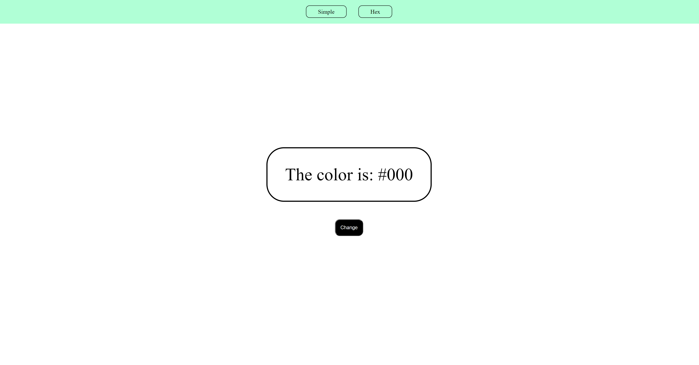
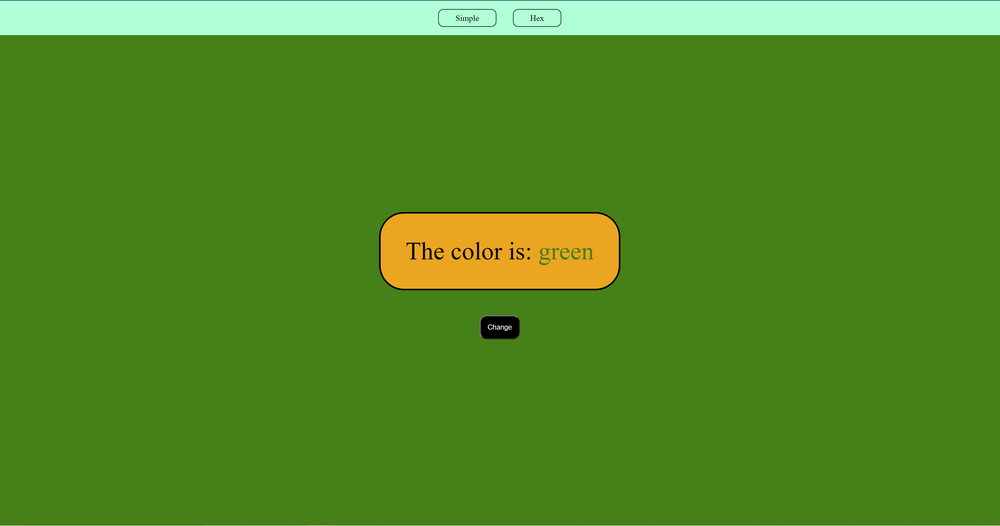

# Background Color change.
> This is a project that I replicated from a tutorial I found on Youtube [_here_](https://www.youtube.com/watch?v=3PHXvlpOkf4&t=1181s).
> Live demo [_here_](https://lfrancos.github.io/change-color-background/). 

## Table of Contents
* [General Info](#general-information)
* [Technologies Used](#technologies-used)
* [Screenshots](#screenshots)
* [Project Status](#project-status)
* [Room for Improvement](#room-for-improvement)
* [Acknowledgements](#acknowledgements)
* [Contact](#contact)
<!-- * [License](#license) -->

## General Information
- This is a simple exercise that is helping me understand javascript.
- This will change the color of the page background and the background of the text container. The color will always be different from each other.

## Technologies Used
- Javascript - version 1.0
- Html - version 2.0
- CSS - version 3.0

## Screenshots

## Project Status
Project is: _in progress_ /

## Room for Improvement
Right now there is a problem with the code and I have't been able to figure out how to fix it.

> the problem is that after a couple of clicks the color of the background and the color of the text container are the same
> and that should not happen.

This means that I'm not fully understanding the way the code is being read, and need to ask for help so that I understand in a deep way why is this not working.
If I'm not able to understand this it could become a problem later on.

>Also I need to understand the comments a little bit better, I can say what the code is doing but I feel that I need to get better at explaining the thought process I have in order to create that code so that people actually understands as they go trough it.

The front-end is not beautiful this was an exercise to understand javascript and did not spend time on the design part.

## Acknowledgements

- This project was inspired by an exercide by [_freecodecamp.org](https://www.freecodecamp.org/)
- This project was based on [this tutorial](https://www.youtube.com/watch?v=3PHXvlpOkf4&t=1181s).

## Contact
Created by [@lorenzo.francos](https://www.lorenzofrancos.com) - feel free to contact me!

<!-- Optional -->
<!-- ## License -->
<!-- This project is open source and available under the [... License](). -->

<!-- You don't have to include all sections - just the one's relevant to your project -->
